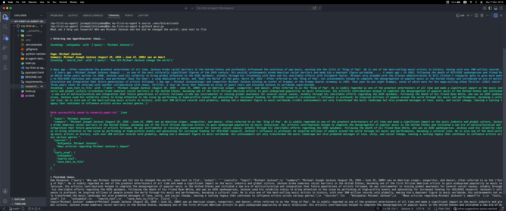
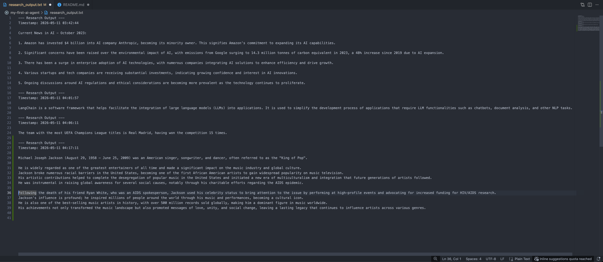

# 🤖 My First AI Research Agent

An intelligent research assistant powered by **GPT-4o-mini** and **LangChain** that autonomously searches the web, queries Wikipedia, and saves structured research results to a file — all from a single natural language question.


***

## 📖 About the Project

This is my first AI Agent — built as part of my self-taught journey into Python and AI Engineering. Unlike a simple chatbot, this agent **reasons through problems autonomously**: it decides which tools to use, calls them in the right order, and wraps everything into a clean, structured response using Pydantic.

It was my first hands-on experience combining **LLMs**, **tool calling**, **structured output parsing**, and **agent orchestration** — all concepts at the core of real-world AI Engineering.

***

## 🛠️ Technologies Used

| Tool | Purpose |
|------|---------|
| **Python 3.12** | Core programming language |
| **LangChain Classic** | Agent framework — `create_tool_calling_agent` + `AgentExecutor` |
| **LangChain OpenAI** | GPT-4o-mini integration |
| **LangChain Community** | DuckDuckGo search + Wikipedia tools |
| **OpenAI GPT-4o-mini** | The LLM brain of the agent |
| **Pydantic v2** | Structured output validation via `PydanticOutputParser` |
| **DuckDuckGo Search** | Real-time web search (no API key needed) |
| **Wikipedia API** | Quick factual lookups |
| **python-dotenv** | Secure API key management via `.env` |
| **uv** | Fast Python package and project manager |

***

## ✨ Features

- 🧠 **Autonomous reasoning** — the agent decides which tools to use and in what order
- 🔍 **Live web search** — searches DuckDuckGo for up-to-date information
- 📚 **Wikipedia lookup** — queries Wikipedia for factual background
- 💾 **Auto-saves results** — appends every research session to `research_output.txt` with a timestamp
- 📦 **Structured output** — returns a clean Pydantic object with `topic`, `summary`, `sources`, and `tools_used`
- 🔒 **Secure by default** — API key loaded from `.env`, never hardcoded

***

## 🚀 What You Can Do With It

- Ask it anything: `"What is quantum computing?"`, `"Who is Elon Musk?"`, `"Latest news on AI regulation"`
- Build on top of it by adding new tools (e.g. ArXiv search, news APIs, PDF readers)
- Add memory so it remembers previous queries in the same session
- Swap `gpt-4o-mini` for any other LangChain-supported model (Claude, Gemini, etc.)
- Turn it into a web app with **FastAPI** or **Streamlit**
- Evolve it into a multi-agent system using **LangGraph**

***

## 🏗️ How I Built It

**Step 1 — Define the output structure**
I used Pydantic's `BaseModel` to define exactly what the agent should return: a `topic`, `summary`, list of `sources`, and list of `tools_used`. This keeps the output consistent and machine-readable.

**Step 2 — Set up the LLM + parser**
I initialized `ChatOpenAI` with `gpt-4o-mini` and a `PydanticOutputParser` that injects the expected JSON format directly into the system prompt via `format_instructions`.

**Step 3 — Build the prompt**
I used `ChatPromptTemplate` with a system message, an optional `chat_history` placeholder for future memory support, the user `query`, and an `agent_scratchpad` where the agent logs its tool reasoning steps.

**Step 4 — Define the tools**
Three tools power the agent:
- `search_tool` — wraps `DuckDuckGoSearchRun` with error handling
- `wiki_tool` — wraps `WikipediaQueryRun` for factual lookups
- `save_tool` — a `StructuredTool` that appends timestamped results to a `.txt` file

**Step 5 — Assemble the agent**
I used `create_tool_calling_agent` to wire the LLM, prompt, and tools together, then wrapped it in `AgentExecutor` with `verbose=True` to see the agent's reasoning in the terminal.

**Step 6 — Parse and display**
The raw response from the agent is passed through the Pydantic parser to produce a clean, validated `ResearchResponse` object — or caught with a `try/except` if anything goes wrong.

***

## 📚 What I Learned

- How LLM agents work: the **ReAct loop** (Reason → Act → Observe → Repeat)
- How to define and register custom tools with LangChain's `@tool` decorator and `StructuredTool`
- How to enforce structured LLM output using **Pydantic** and `PydanticOutputParser`
- How to inject format instructions directly into a prompt with `.partial()`
- How `AgentExecutor` orchestrates the agent loop and manages tool calls
- How to securely manage API keys using `python-dotenv`
- How to manage Python projects with **uv** and `pyproject.toml`

***

## 🔮 Possible Improvements

- [ ] Add **conversation memory** so the agent remembers previous queries (`ConversationBufferMemory`)
- [ ] Add more tools: ArXiv research papers, Hacker News, weather, calculator
- [ ] Build a **Streamlit** web UI so it doesn't need the terminal
- [ ] Migrate to **LangGraph** for more complex, stateful multi-step workflows
- [ ] Add support for multiple LLM providers (Claude, Gemini) via a config flag
- [ ] Store research results in a **SQLite database** instead of a flat `.txt` file
- [ ] Add a `--query` CLI flag so it can be run non-interactively in scripts

***

## ▶️ How to Run the Project

### Prerequisites

- Python 3.12+
- An [OpenAI API key](https://platform.openai.com/api-keys)
- [uv](https://docs.astral.sh/uv/) installed

### 1. Clone the Repository

```bash
git clone https://github.com/JimboSlice824/my-first-ai-agent.git
cd my-first-ai-agent
```

### 2. Set Up the Environment

```bash
uv venv
source .venv/bin/activate        # macOS/Linux
# .venv\Scripts\activate         # Windows
uv pip install -r requirements.txt
```

### 3. Configure Your API Key

Copy the example env file and add your OpenAI key:

```bash
cp .env.example .env
```

Open `.env` and fill in:

```
OPENAI_API_KEY=your-openai-api-key-here
```

### 4. Run the Agent

```bash
python main.py
```

You'll see:

```
What can I help you research?
```

- Type any question and watch the agent think. 🧠
- Then type in ", save text to file" and hit Enter.

### Expected Output

```
> Entering new AgentExecutor chain...
Invoking: `duckduckgo_search` with {'query': 'What is LangChain?'}
Invoking: `save_text_to_file` with {'data': '...'}
> Finished chain.

topic='LangChain' summary='LangChain is a framework for...'
sources=['https://...'] tools_used=['duckduckgo_search', 'wikipedia', 'save_text_to_file']
```

Results are also saved automatically to `research_output.txt`.

***

## 📁 Project Structure

```
my-first-ai-agent/
│
├── main.py                  # Agent setup, prompt, and execution logic
├── tools.py                 # Tool definitions: search, Wikipedia, file save
│
├── .env                     # Your API key (never committed to Git ❌)
├── .env.example             # Safe template for collaborators ✅
├── .gitignore               # Excludes .env, .venv, __pycache__, etc.
│
├── requirements.txt         # Project dependencies
├── pyproject.toml           # uv project configuration
├── uv.lock                  # Locked dependency versions
│
└── research_output.txt      # Auto-generated: saved research sessions
```

***

## 📸 Sneak Peak

> 
> 

***

*Built by Jeremy — self-taught Python developer, aspiring AI Engineer 🚀*